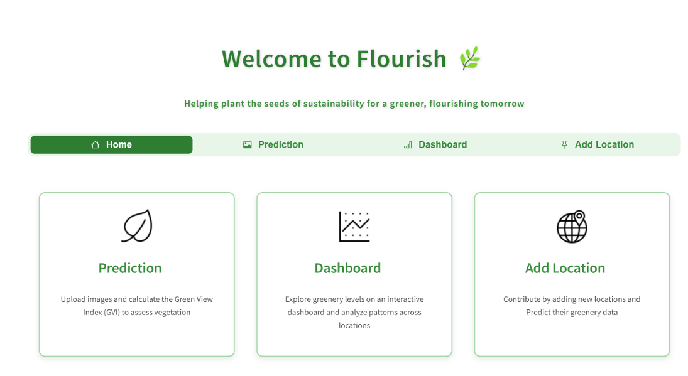
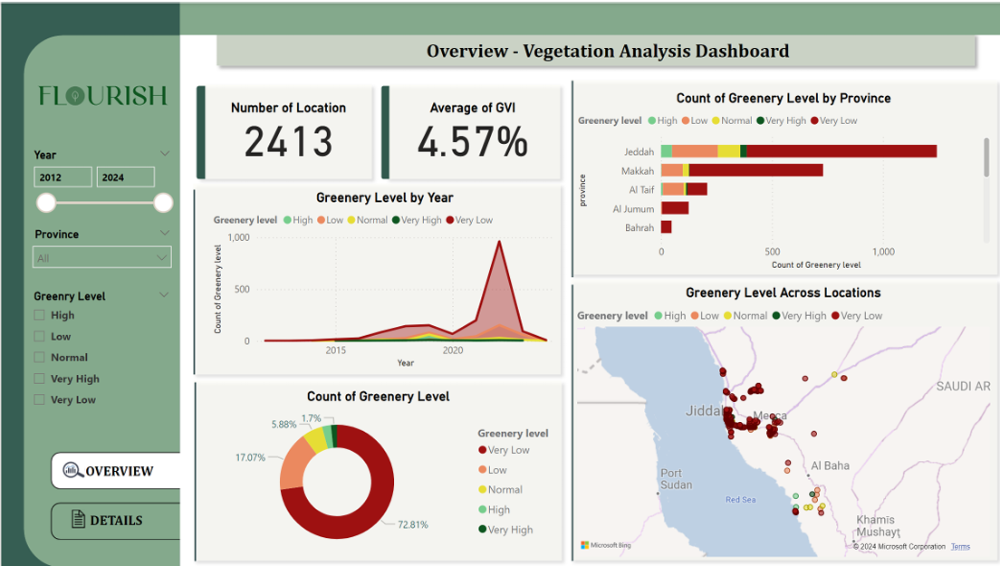

# 🌿 Flourish: Assessing Street-Level Urban Greenery in Makkah Province Using Google Street View and Deep Learning

## 📌 Overview

Desertification is a major environmental concern in Saudi Arabia, affecting ecosystems, human health, and urban livability. Traditional greenery monitoring methods are labor-intensive, costly, and error-prone. This project presents a scalable, automated deep learning solution to assess street-level urban greenery in **Makkah Province** using **Google Street View (GSV)** imagery.

We utilized advanced **semantic segmentation models** (U-Net, DeepLabv3+, PSPNet) to detect vegetation and compute the **Green View Index (GVI)** across different geolocations using GSV images, improving the accuracy, cost-efficiency, and scalability of urban greenery assessment.

---

## 🚀 Key Features

- ✅ Automatic detection and segmentation of urban greenery
- 🌍 Dataset of **9,652** GSV images across four directions (0°, 90°, 180°, 270°)
- 🧠 Trained using **U-Net**, **DeepLabv3+**, and **PSPNet** for comparison
- 📊 Metrics used: Precision, Recall, Dice Coefficient, IoU
- 🧩 Addressed class imbalance with weighted loss functions

---

## 🛠️ Methodology

### 🔍 Data Collection

- Collected images from **Google Street View Static API**
- Locations sampled throughout **Makkah Province**
- Used HTTP URL requests to automate scraping
- Captured 4 images per location with varying headings (0°, 90°, 180°, 270°)

### 🖼️ Preprocessing

1. **Annotation**: Labeled vegetation using Roboflow's smart polygon tool  
2. **Resizing**: All images resized to 256×256 pixels  
3. **Normalization**: Pixel values scaled to [0, 1]  
4. **Mask Processing**: RGB masks converted to binary format  
5. **Augmentation**: Random flipping and 90° rotations  
6. **Class Balancing**: Weighted loss for imbalance  
7. **Data Split**: 80% training, 10% validation, 10% testing  

---

## 🧠 Models

### 1. **U-Net**
- Best performer on Recall, Dice Coefficient, IoU
- Skip-connection encoder-decoder architecture
- Efficient on small and unbalanced datasets

### 2. **DeepLabV3+**
- Utilizes atrous convolution for multi-scale context
- Highest precision across all models
- Performs robustly with large-scale features

### 3. **PSPNet**
- Pyramid pooling captures global context
- Strong performance on diverse scenes
- Slightly lower recall due to class imbalance

---

## 📈 Results Summary

| Metric        | U-Net      | DeepLabV3+ | PSPNet     |
|---------------|------------|------------|------------|
| **Precision** | 87.0%      | **88.7%**  | 88.0%      |
| **Recall**    | **89.1%**  | 86.5%      | 76.1%      |
| **Dice**      | **86.2%**  | 85.0%      | 83.5%      |
| **IoU**       | **76.4%**  | 74.5%      | 70.2%      |

✅ **U-Net** achieved the most balanced performance, making it ideal for urban greenery segmentation.

---

## 📂 Repository Structure

```bash
📄 Extract_image.py     # Data Collection using google API
📄 DeeplabV3+_model.ipynb
📄 Fpspnet_model.ipynb
📄 Unet_modelF.ipynb
📄 Fpspnet_model.h5     # PSPNet weights
📄 README.md
```

---

## 📦 Model Weights

📁 **Model Weights (.h5) for U-Net and DeepLabV3+ are stored externally due to size limits:**

- 🔗 [Download U-Net model](https://drive.google.com/file/d/18SAeJtGpvcGlrzhLWltX6Ime45ifOmGV/view?usp=sharing)
- 🔗 [Download DeepLabV3+ model](https://drive.google.com/file/d/1WcO8XFIV9qfRJMT4aaEp9BezOvMwIYAZ/view?usp=sharing)

---

## 🖥️ Deployment

This section describes deploying our deep learning models for vegetation analysis using a **Streamlit web application**.

### 🌐 Features

- 🗂 **Application Setup**: Users can select from local models (**U-Net**, **PSPNet**, **DeepLabV3+**).
- 📤 **Upload Images**: Multiple image support for batch analysis.
- 🧠 **Model Prediction**: Automatically loads the selected model and performs vegetation segmentation.
- 🌿 **GVI Calculation**: Computes the Green View Index by comparing greenery pixels to total image area.
- 📊 **Interactive Dashboard**: Visually presents GVI levels across various locations.
- ➕ **Add New Location**: Users can expand the dataset by uploading images from new GSV coordinates.

### 🖼️ Streamlit Application Screenshots


##### Interface


##### Prediction


##### Dashboard

